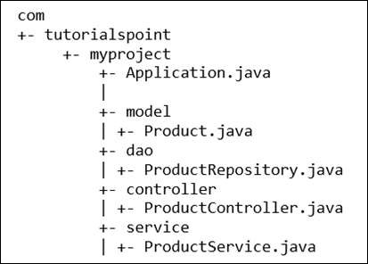

# Readme

This is a full stack project, using Java, Thymeleaf as a template engine, Redis as database, bootstrap for css.

We shall see how it goes.

# Spring Boot Learning

## Start with the basics

Using my previous learning markdown document, `What is Thymeleaf and what does it do?`, I'm going to setup a new project and follow that material.

### Resources: 

https://www.tutorialspoint.com/spring_boot/spring_boot_bootstrapping.htm

Canvas REST class from Nov 15, recording 3, second half, which does the following:

- Create a template page for entering new items
- Create a template page for finding items
- Create a Rest Controller
- Create a Generic Controller

### Setup project structure

1. Use Spring Initializer website, add dependencies Spring Web (for REST), Spring Redis Data layer or something, and Thymeleaf for a template engine. Import into Eclipse. 

2. In accordance with the recommended structure below, I create the following package structure:

   `com.example.springthymeredis `- your main application location.

   `com.example.springthymeredis.model`

   `com.example.springthymeredis.controller`

   Create a template page for entering new items:

   - Under template, create `greeting.html` view.

## Miscellaneous

### What is Bootstrapping

I think it's how you initialize a Spring Boot application.

According this [this](https://www.tutorialspoint.com/spring_boot/spring_boot_bootstrapping.htm), we can bootstrap a Spring Boot application using [Spring Initializr](https://start.spring.io/). You define a few parameters, select dependencies (which go into `pom.xml` or `build.gradle`), and download. 

Maven and Gradle are build automation tools, like Jenkins. A quick examination of Maven and Gradle indicates that Maven is XML based, and Gradle might be json based. These build tools handle dependency management.

In the following, we inherit a starter parent. 

Shortened Maven `pom.xml`:

```xml
<?xml version = "1.0" encoding = "UTF-8"?>
<project xmlns = "http://maven.apache.org/POM/4.0.0" 
   xmlns:xsi = "http://www.w3.org/2001/XMLSchema-instance"
   xsi:schemaLocation = "http://maven.apache.org/POM/4.0.0 
   http://maven.apache.org/xsd/maven-4.0.0.xsd">

   <dependencies>
      <dependency>
         <groupId>org.springframework.boot</groupId>
         <artifactId>spring-boot-starter-web</artifactId>
      </dependency>

</project>
```

Shortened Gradle `build.gradle`:

```json
buildscript {
   ext {
      springBootVersion = '1.5.8.RELEASE'
   }
   repositories {
      mavenCentral()
   }
   dependencies {
      classpath("org.springframework.boot:spring-boot-gradle-plugin:${springBootVersion}")
   }
}
```

If you want a REST endpoint, you need to add dependency spring-boot-starter-web in the class-path.

```xml
<dependencies>
   <dependency>
      <groupId>org.springframework.boot</groupId>
      <artifactId>spring-boot-starter-web</artifactId>
   </dependency>
</dependencies>   
```

### Structure

Java's recommended naming convention for package declaration is reversed domain name. For example − **com.tutorialspoint.myproject**.

According this [this](https://www.tutorialspoint.com/spring_boot/spring_boot_code_structure.htm) tutorial, the typical Spring Boot application is the following:



where DAO stands for Data Access Object.

> The Application.java file should declare the main method along with @SpringBootApplication.

```java
package com.tutorialspoint.myproject;

import org.springframework.boot.SpringApplication;
import org.springframework.boot.autoconfigure.SpringBootApplication;

@SpringBootApplication
public class Application {
   public static void main(String[] args) {SpringApplication.run(Application.class, args);}
}
```

### What are these @ symbols?

In python, these are decorators. Decorates merely wrap a function. As indicated by [this](https://stackoverflow.com/questions/10191561/decorator-in-python/10192361#10192361) post:

```python
@decorator
def function(args):
    #body
```

is the same as:

```python
def function(args):
    #body
function = decorator(function)
```

In Java, @ is called annotators, according to [Oracle](https://docs.oracle.com/javase/1.5.0/docs/guide/language/annotations.html),

> Many APIs require a fair amount of boilerplate code...This boilerplate could be generated automatically by a tool if the program were “decorated” with annotations indicating which methods were remotely accessible.

According to [this](https://stackoverflow.com/a/71864556/5825523) SO answer, there's no universal definition of what annotations do. 

> "What is an annotation?" It turns out that there is no answer to this question, in the sense that there is *no common behavior* which is present in *all* of the various kinds of java annotations...there is no common feature linking all annotations that could be used to put them in a conceptual group. In other words, annotations as a concept do not exist.

# What is Thymeleaf and what does it do?

https://stackoverflow.com/tags/thymeleaf/info
https://www.thymeleaf.org

It's a template engine. If you go to https://start.spring.io/ and click dependencies, you can see other template options including Apache Freemarker, Mustache, and Groovy. For Node.js, the leading template engine is Handlebars, I believe. What you insert into the HTML to capture variables might be called *hooks*.

Thymeleaf's a Java library for making MVC HTML views. It's a JSP alternative.

It typically serves as a webapp's HTML view layer. 

A *webapp* is an application running on a server.

It can be integrated with Spring, so it can be used as a JSP alternative.

It's an HTML template engine (extensible to other formats) that works for both web and standalone environments.

Thymeleaf's provides a good way to create templates, and use them as static prototypes.

Unlike JSP, Thymeleaf is a **natural** template engine, meaning that the file could be directly opened in browsers without having to run the application. I think that means it makes an html file. A natural template:

```html
<table>
  <thead>
    <tr>
      <th th:text="#{msgs.headers.name}">Name</th>
      <th th:text="#{msgs.headers.price}">Price</th>
    </tr>
  </thead>
  <tbody>
    <tr th:each="prod: ${allProducts}">
      <td th:text="${prod.name}">Oranges</td>
      <td th:text="${#numbers.formatDecimal(prod.price, 1, 2)}">0.99</td>
    </tr>
  </tbody>
</table>
```

- Simple expressions:
  - Variable Expressions: `${...}`
  - Selection Variable Expressions: `*{...}`
  - Message Expressions: `#{...}`
  - Link URL Expressions: `@{...}`
  - Fragment Expressions: `~{...}`

Thymeleaf can process 6 kinds of templates

1. html
2. xml
3. text
4. js
5. css
6. raw

Thymeleaf can be an html page containing thymeleaf expressions.


Thymeleaf engine parses Thymeleaf templates.

The java model's data is read into the view (thyemleaf template). Thymeleaf engine then produces static html page.


If webapp, thymeleaf is processed on the server. Rendered html is sent back to client browser.

## Create basic thymeleaf webapp

When you first create a Thymeleaf project using Spring Initializer site, include two dependencies. These are visible in the resultant `pom.xml`, Project Object Model. This sounds like DOM, Document Object Model used in html. Both are Object Models, which when googled renders this site: https://www.techopedia.com/definition/8635/object-model#:~:text=An%20object%20model%20is%20a,oriented%20programming%20(OOP)%20lifecycle.

> An object model is a logical interface, software or system that is **modeled through the use of object-oriented techniques**. It enables the creation of an architectural software or system model prior to development or programming.
>
> An object model is part of the object-oriented programming (OOP). An object model helps describe or define a software/system in terms of objects and classes. It defines the interfaces or interactions between different models, inheritance, encapsulation and other object-oriented interfaces and features.


Create a Spring MVC controller, via creating a new class in main.

@Controller is used to mark a class as a web request handler.

```java
package net.javaguides.springboot;

import org.springframework.stereotype.Controller;
import org.springframework.ui.Model;
import org.springframework.web.bind.annotation.GetMapping;

@Controller
public class HelloWorldController {

	// create a method handler which returns "hello world"
	@GetMapping("/hello")  // reference url /hello
	public String hello(Model model) {  // this will return some data, so use a Model
		model.addAttribute("message", "Hello world");  // key value. copy "message" into html template
		return "helloworld";  // returns a thymeleaf template `helloworld.html`
	}	
}
```

Create an HTML thymeleaf template.

Thymeleaf dir structure has `static` for js, css, and `templates` for html.

```html
<!DOCTYPE html>
<!-- add this to reference thymeleaf functionality -->
<html xmlns:th="https//thymeleaf.org"> 
<head>
<meta charset="ISO-8859-1">
<title>Thymeleaf helloworld app</title>
</head>
<body>
	<!-- thymeleaf variable expression -->
	<h1 th:text = "'Thymeleaf ' + ${message} + ' App'"></h1>
</body>
</html>
```

Run it by browsing to `http://localhost:8080/hello`

## Add CSS and JS

Thymeleaf dir structure has `static` for js, css, and `templates` for html.

We now add files to `static`.

Could not parse as expression: "@{/js/actions.js" (template: "add-css-js-demo" - line 8, col 32)

For killing whatevers running on port 8080:

```cmd
C:\Users\me>netstat -ano | findstr :8080
  TCP    0.0.0.0:8080           0.0.0.0:0              LISTENING       2460
  TCP    [::]:8080              [::]:0                 LISTENING       2460
  TCP    [::1]:8080             [::1]:52170            TIME_WAIT       0

C:\Users\me>taskkill /PID 2460 /F
SUCCESS: The process with PID 2460 has been terminated.
```

## Add bootstrap css library to thymleap template

https://stackoverflow.com/tags/twitter-bootstrap/info
https://getbootstrap.com/
https://github.com/twbs/bootstrap

The most popular HTML, CSS, and JavaScript framework for developing responsive, mobile first projects on the web.

[Bootstrap](https://getbootstrap.com/) = a css framework for responsive, mobile-first frontend development. It includes html, css and (optionally) js templates for typography, forms, buttons, navigation, etc. On SO, it's tagged [twitter-bootstrap]. 2022/07, it's the eighth most starred project on GitHub.

If you only want Bootstrap's compiled css or js, you can use jsDelivr.

```html
<!-- CSS only -->
<link href="https://cdn.jsdelivr.net/npm/bootstrap@5.2.2/dist/css/bootstrap.min.css" rel="stylesheet" integrity="sha384-Zenh87qX5JnK2Jl0vWa8Ck2rdkQ2Bzep5IDxbcnCeuOxjzrPF/et3URy9Bv1WTRi" crossorigin="anonymous">
```

or

```html
<!-- JavaScript Bundle with Popper -->
<script src="https://cdn.jsdelivr.net/npm/bootstrap@5.2.2/dist/js/bootstrap.bundle.min.js" integrity="sha384-OERcA2EqjJCMA+/3y+gxIOqMEjwtxJY7qPCqsdltbNJuaOe923+mo//f6V8Qbsw3" crossorigin="anonymous"></script>
```

Add bootstrap to project.

Use CDN (content delivery network) https://getbootstrap.com/docs/3.3/getting-started/#download-cdn

## Thymeleaf for each loop

Look at code.

## Thymeleaf if, unless, switch

https://youtu.be/96ompySpPHE?t=2632

## Next

Update Redis project to have a Thymeleaf UI. Due to different dependencies, I think it would be easier to create a new project from scratch.


